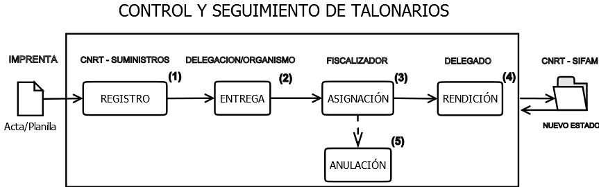

### DESCRIPCIÓN
Aplicativo externo, desarrollado para la C.N.R.T. (Comisión Nacional de Regulación del Transporte) cuyo propósito final es el de llevar un Control y Seguimiento de los Talonarios que provee el Organismo a sus delegaciones y a las Fuerzas de Seguridad en la jurisdicción Nacional.

### CIRCUITO

### OPERACIONES
1.	**REGISTRO** de talonarios.
2.	**ENTREGA** de talonarios. 
3.	**ASIGNACIÓN** de talonarios/actas/ordenes de servicio o control u otro documento legal, que a futuro se defina, a un fiscalizador.
4.	**RENDICIÓN** de actas/ordenes de servicio o control u otro documento legal, que a futuro se defina.
5.	**ANULACIÓN** de actas/ordenes de servicio o control u otro documento legal, que a futuro se defina.
Aparte de las citadas operaciones, se pueden realizar consultas relacionadas al stock, actas rendidas, anuladas, consultas de métricas por fiscalizador y visualización de remitos, dependiendo siempre del tipo de rol con el que se cuente.

### ROLES
- SUMINISTRO
- COORDINADOR
- AUDITORIA
- ADMINISTRATIVO
- RESPONSABLE_DELEGACION

### API REST
Además, el aplicativo tiene una comunicación bi-direccional con el Organismo. Desde el mismo, se consumen datos de un WS de CNRT para mostrar aquellas **delegaciones** activas, **responsables** y **fiscalizadores** de delegaciones (en una futura versión, también otros documentos legales además de las Actas y Planillas ya cargadas). Por otra parte, desde el Ministerio de Transporte, se ofrecen los estados actuales de un Acta u Orden de Servicio, además de guardar estados de SIFAM recibidos por el mismo medio.

Desde [AQUÌ](http://intranet.transporte.gob.ar:8087/api/doc) se accede a la documentación.
